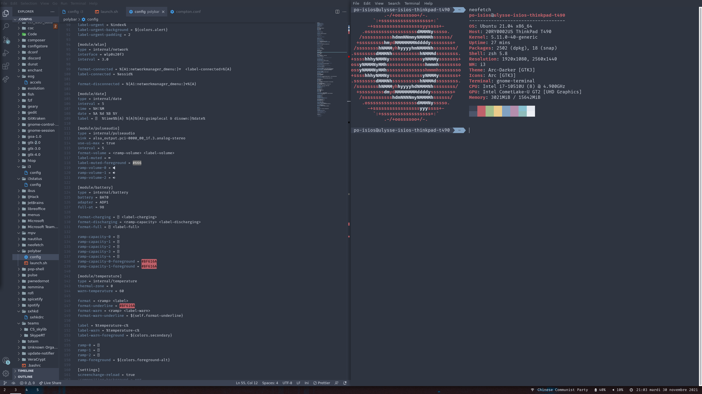

# Installation steps :
  
  ## i3
    sudo apt update
    sudo apt install i3

  ## git-hooks integration
    execute script from hooks/pre-commits
  
  ## fonts
    sudo apt update
    sudo apt install fonts-firacode
    font_url='https://github.com/ryanoasis/nerd-fonts/releases/download/v2.1.0/FiraCode.zip'; font_name=${font_url##*/}; wget ${font_url} && unzip ${font_name} -d ~/.fonts && fc-cache -fv;

  ## polybar
    sudo apt install polybar

  ## rofi
    sudo apt install rofi

    or build from release
      
    1. Clone repo : https://github.com/davatorium/rofi
    mkdir build && cd build
    ../configure
    make
    make install
    
    The default installation prefix is: /usr/local/ use ./configure --prefix={prefix} to install into another location. 

  Copy all files in ~/.config
  done !
  ## preview
  

